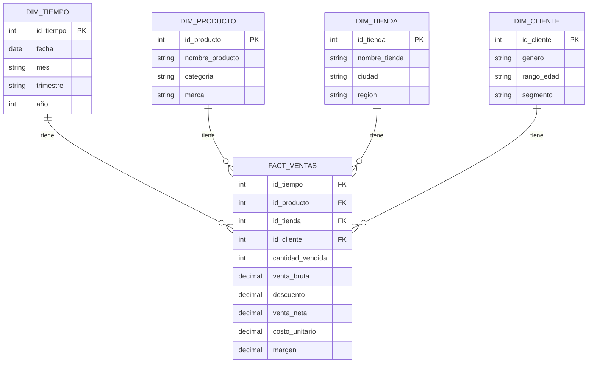

# Actividad Calificable — Diseño de Modelo Estrella

## 1. Proceso de negocio elegido

Proceso: ventas en tienda (punto de venta retail).

Pregunta de negocio: ¿cómo están evolucionando las ventas por tienda, producto y mes, y qué combinaciones de producto/tienda están por debajo de la meta de ingresos?

KPI y meta: el KPI es el ingreso total mensual por tienda, calculado como la suma de `venta_neta`. La meta es incrementar el ingreso mensual por tienda en un 8% trimestral respecto al trimestre anterior, y mantener el ticket promedio por encima de $45.000 COP.

---

## 2. Clasificación del sistema de origen: OLTP

El sistema que registra cada venta (el POS / ERP transaccional) es un sistema OLTP (Online Transactional Processing) porque registra transacciones individuales en tiempo real, cada venta y cada línea de factura de forma independiente. Está normalizado en tercera forma normal para garantizar integridad y evitar redundancia en las operaciones diarias de inventario, clientes y facturación. Además, prioriza operaciones rápidas de inserción y actualización sobre pocas filas a la vez, en lugar de lecturas masivas. Por diseño, no está optimizado para agregaciones históricas ni para consultas analíticas complejas sobre grandes volúmenes de datos.

### ¿Por qué el análisis debe hacerse en un entorno OLAP / warehouse?

Un análisis como "ventas por tienda, producto y mes en los últimos 3 años" requiere leer y agregar millones de filas históricas, algo para lo cual el OLTP no está diseñado, pues su rendimiento se degradaría y afectaría las ventas en curso. Este tipo de consulta necesita un modelo desnormalizado, como la estrella, optimizado para lectura y agregación mediante funciones como SUM, AVG y COUNT, en vez de transacciones puntuales. También requiere un histórico consolidado proveniente de múltiples fuentes, como POS, inventario y CRM, algo que el OLTP no conserva ni combina por diseño. Finalmente, permite ejecutar consultas ad-hoc de negocio en herramientas de BI y dashboards sin impactar el sistema transaccional en producción. Por eso los datos se extraen del OLTP mediante un proceso ETL/ELT y se cargan en un Data Warehouse OLAP, modelado en estrella para facilitar el análisis.

---

## 3. Modelo Estrella

### Tabla de Hechos: `FACT_VENTAS`

Grano: una fila por línea de venta, es decir, por producto vendido dentro de una transacción.

| Columna | Tipo | Descripción |
|---|---|---|
| `id_tiempo` (FK) | INT | Referencia a DIM_TIEMPO |
| `id_producto` (FK) | INT | Referencia a DIM_PRODUCTO |
| `id_tienda` (FK) | INT | Referencia a DIM_TIENDA |
| `id_cliente` (FK) | INT | Referencia a DIM_CLIENTE |
| `cantidad_vendida` | INT | Medida — unidades vendidas |
| `venta_bruta` | DECIMAL | Medida — valor sin descuentos |
| `descuento` | DECIMAL | Medida — valor del descuento aplicado |
| `venta_neta` | DECIMAL | Medida — venta_bruta menos descuento |
| `costo_unitario` | DECIMAL | Medida — costo del producto vendido |
| `margen` | DECIMAL | Medida — venta_neta menos costo total |

### Dimensiones

#### DIM_TIEMPO
| Atributo | Ejemplo |
|---|---|
| id_tiempo (PK) | 20260315 |
| fecha | 2026-03-15 |
| dia_semana | Domingo |
| mes | Marzo |
| trimestre | Q1 |
| año | 2026 |
| es_fin_de_semana | Sí/No |

#### DIM_PRODUCTO
| Atributo | Ejemplo |
|---|---|
| id_producto (PK) | 1045 |
| nombre_producto | Camisa algodón |
| categoria | Ropa |
| subcategoria | Camisas |
| marca | Marca X |
| precio_lista | 89.000 |

#### DIM_TIENDA
| Atributo | Ejemplo |
|---|---|
| id_tienda (PK) | 12 |
| nombre_tienda | Tienda Centro |
| ciudad | Neiva |
| departamento | Huila |
| region | Sur |
| formato | Mall / Calle |

#### DIM_CLIENTE
| Atributo | Ejemplo |
|---|---|
| id_cliente (PK) | 5023 |
| nombre_cliente | Cliente anónimo/registrado |
| genero | F/M/N.A. |
| rango_edad | 25-34 |
| segmento | Frecuente / Ocasional |

### Diagrama de la estrella

La estructura queda representada en forma de estrella: `FACT_VENTAS` en el centro, conectada mediante llaves foráneas a `DIM_TIEMPO`, `DIM_PRODUCTO`, `DIM_TIENDA` y `DIM_CLIENTE` alrededor.

---

## 4. Preguntas de negocio que responde el modelo

1. ¿Cuál fue el ingreso neto total por tienda y por mes en el último trimestre?
2. ¿Qué categoría de producto tiene el mayor margen promedio por región?

---

## 5. Model & Questions (English section)

The fact table `FACT_VENTAS` stores one row per product line sold in a transaction, capturing measures such as `cantidad_vendida` (quantity sold), `venta_bruta` (gross sale), `descuento` (discount), `venta_neta` (net sale), `costo_unitario` (unit cost), and `margen` (profit margin). This table is linked to four dimension tables, `DIM_TIEMPO`, `DIM_PRODUCTO`, `DIM_TIENDA`, and `DIM_CLIENTE`, through foreign keys, forming a classic star schema optimized for analytical queries. Unlike the transactional OLTP system, this star schema is denormalized to support fast aggregation across large historical volumes without impacting daily store operations. Analysts can use it to answer questions such as "what was the total net revenue per store per month over the last quarter" and "which product category has the highest average margin by region." These questions require summing and grouping millions of historical rows, which is exactly what the star schema and the OLAP warehouse are designed to do efficiently.
